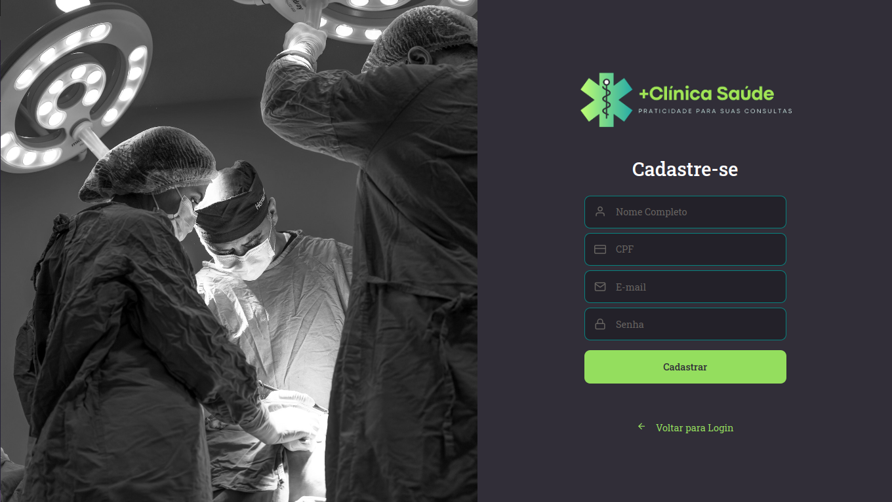
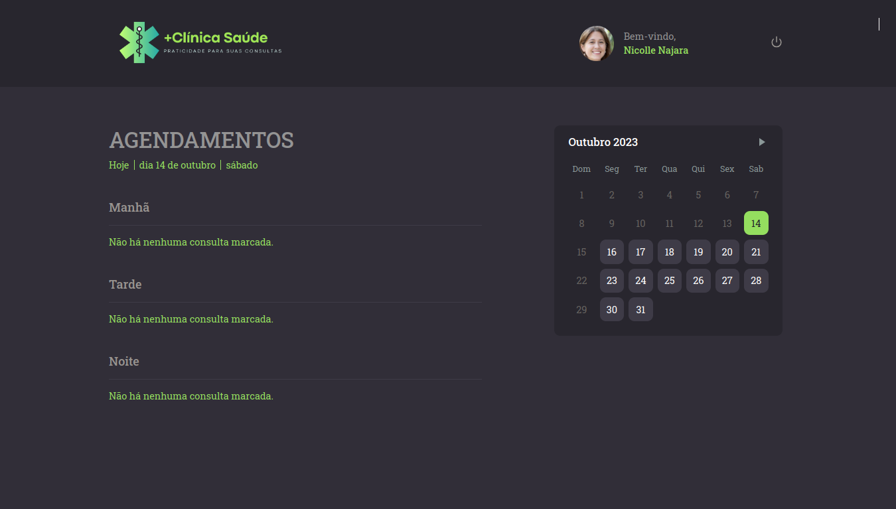
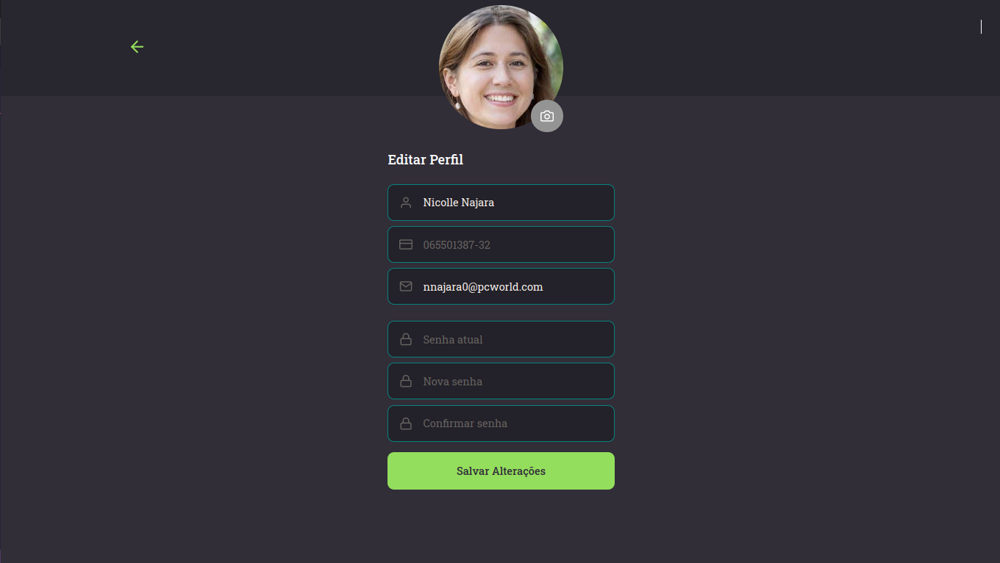

<h1 align="center">
  
</h1>

 +Clinica Saúde é um sistema de agendamento para consultas.

---

   
  
  
  

---

### Ferramentas utilizadas na aplicação:

- [Axios](https://github.com/axios/axios)
- [Date-fns](https://date-fns.org/)
- [jest](https://jestjs.io/pt-BR/)
- [ReactJS](https://github.com/facebook/react).
- [React Toastify](https://github.com/fkhadra/react-toastify)
- [Styled-components](https://github.com/styled-components/styled-components)
- [TypeScript](https://www.typescriptlang.org/)
- [Yup](https://github.com/jquense/yup)

### Ferramentas utilizadas no ambiente de desenvolvimento:

- [ESLint](https://github.com/eslint/eslint) - Lint para identificar erros em tempo de desenvolvimento.
- [Prettier](https://github.com/prettier/prettier) - Padroniza e melhora a visualização do código.

---

## :memo: Licença

Feito com :purple_heart: by [Michael W.Lopes](https://github.com/michael23-lopes)

---
